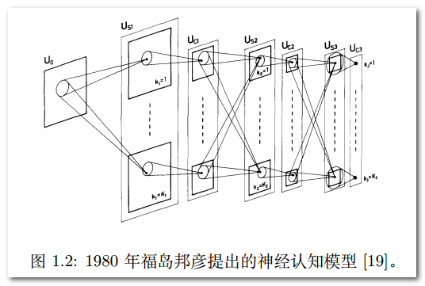
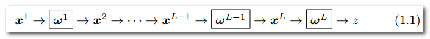
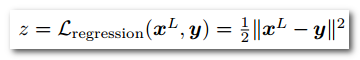
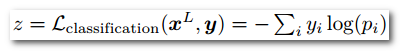
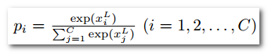
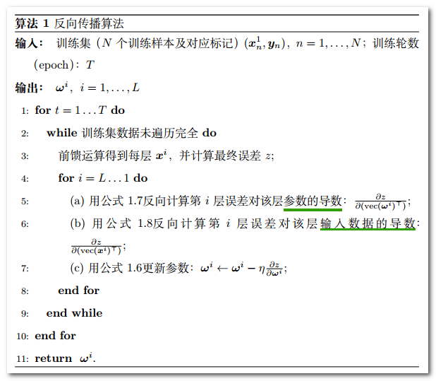
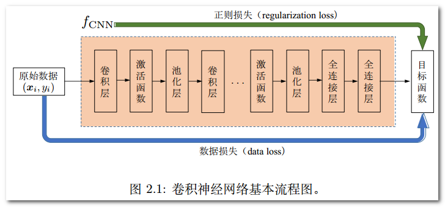
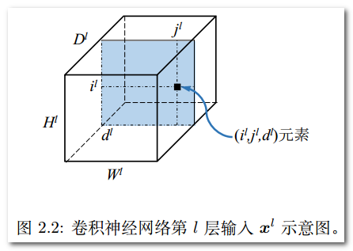
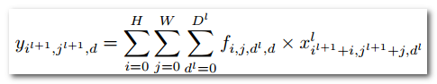

## 
卷积神经网络

#### 0.1 引言

##### 前世今生
1. 二十世纪四十至六十年代当时广为人知的控制论。
    1. 无法处理“**异或**”问题
    2. 无法满足大型神经网络长时间的运行需求。
2. 80年代提出误差反向传播算法(BPA)。
    1. 数据获取瓶颈
    2. 过拟合(overfitting)问题
3. 2006年提出深度置信网络(deep belief network)。

### 第一章 CNN基础知识
#### 1.1 发展历程
1.1998年基于梯度学习的**LeNet**网络应用于邮政手写数字识别系统。
2. 2012年**Alex-Net**在ImageNet竞赛夺冠。

    

#### 1.2 基本结构
首先，CNN为一种层次模型(hierarchical model)，理论上在每一个隐层中存在：

1. 输入层
2. 卷积操作(convolution)
3. 汇合操作/池化操作(pooling)
4. 非线性激活函数(non-linear activation function)
5. 全连接层

    

**回归问题**主要使用L2损失函数：

    

**分类问题**主要使用交叉损失函数：

    

    

批处理随机梯度下降法：

- 在每一个批处理过程中都会进行参数更新(误差反向传播)。
- 不同批处理之间按照无放回抽样遍历所有训练集样本，遍历一次训练样本称为“一轮”（epoch）。
- 进行多轮迭代后直到网络参数收敛。

    

### 第2章 CNN基本部件
#### 2.1 端到端思想
- 整个学习流程并不进行人为的子问题划分，而是完全交给深度学习模型直接学习从原始输入到期望输出的映射。整个过程具有协同增效的优势，有更大可能获得全局最优解
- 将原始数据映射为特征（即特征学习）随后再映射为样本标记（即目标任务，如分类）。

    

[卷积层与池化层拓展][1]{:target="_blank"}.
[1]: http://www.cnblogs.com/zf-blog/p/6075286.html "http://www.cnblogs.com/zf-blog/p/6075286.html"

#### 2.2 卷积
卷积运算属于分析数学中的一种运算方式，采用mini-batch训练策略时，网络第L层输入通常是一个四维张量，即：***

**两个重要参数：**

- 通道数 
- 每一批训练样本数

    

**重要超参数：**

- 卷积核大小（亦称卷积参数，convolution kernel或convolution filter）
- 卷积步长（stride）

卷积核按照步长大小在输入图像上**从左至右自上而下**依次将卷积操作**（逐位相乘后累加+偏置项作为一次卷积操作结果）**进行下去，并将结果将作为下一层操作的输入。

形式化的卷积操作可表示为：

    

    

#### 2.1

$$ \times $$
$$
\begin{aligned}
\dot{x} & = \sigma(y-x) \\
\dot{y} & = \rho x - y - xz \\
\dot{z} & = -\beta z + xy
\end{aligned}
$$

### 第2章 CNN基本部件