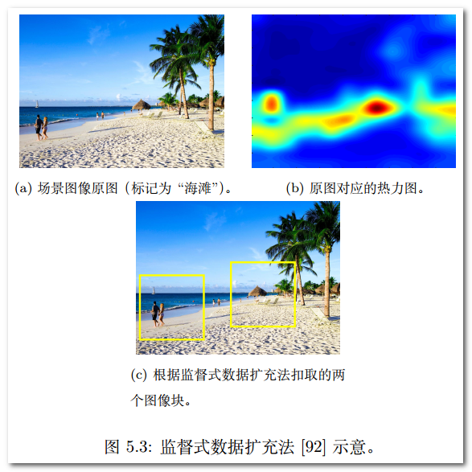
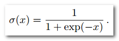

## 
卷积神经网络

#### 0.1 引言

##### 前世今生

1. 二十世纪四十至六十年代当时广为人知的控制论。
    1. 无法处理“**异或**”问题
    2. 无法满足大型神经网络长时间的运行需求。
2. 80年代提出误差反向传播算法(BPA)。
    1. 数据获取瓶颈
    2. 过拟合(overfitting)问题
3. 2006年提出深度置信网络(deep belief network)。

### 第一章 CNN基础知识

#### 1.1 发展历程

1.1998年基于梯度学习的**LeNet**网络应用于邮政手写数字识别系统。
2. 2012年**Alex-Net**在ImageNet竞赛夺冠。

    

#### 1.2 基本结构
首先，CNN为一种层次模型(hierarchical model)，理论上在每一个隐层中存在：

1. 输入层
2. 卷积操作(convolution)
3. 汇合操作/池化操作(pooling)
4. 非线性激活函数(non-linear activation function)
5. 全连接层

    

**回归问题**主要使用L2损失函数：

    

**分类问题**主要使用交叉损失函数：

    

    

**批处理随机梯度下降法：**

- 在每一个批处理过程中都会进行参数更新(误差反向传播)。
- 不同批处理之间按照无放回抽样遍历所有训练集样本，遍历一次训练样本称为“一轮”（epoch）。
- 进行多轮迭代后直到网络参数收敛。

**反向传播算法：**

    

### 第二章 CNN基本部件

#### 2.1 端到端思想

- 整个学习流程并不进行人为的子问题划分，而是完全交给深度学习模型直接学习从原始输入到期望输出的映射。整个过程具有协同增效的优势，有更大可能获得全局最优解
- 将原始数据映射为特征（即特征学习）随后再映射为样本标记（即目标任务，如分类）。

    

**参考文献：**

- [卷积层与池化层][1]{:target="_blank"}.

 [1]: http://www.cnblogs.com/zf-blog/p/6075286.html "http://www.cnblogs.com/zf-blog/p/6075286.html"

#### 2.2 卷积层（convolution）
卷积运算属于分析数学中的一种运算方式，采用mini-batch训练策略时，网络第L层输入通常是一个四维张量，即：***

**两个重要参数：**

- 通道数 
- 每一批训练样本数

    

**重要超参数：**

- 卷积核（亦称卷积参数，convolution kernel或convolution filter）
- 卷积步长（stride）

卷积核按照步长大小在输入图像上**从左至右自上而下**依次将卷积操作**（逐位相乘后累加+偏置项作为一次卷积操作结果）**进行下去，并将结果将作为下一层操作的输入。

形式化的卷积操作可表示为：

    

    

卷积核亦称滤波器：

- 整体边缘滤波器：可消除四周像素值差异小的图像区域而保留显著差异区域，以此检测物体边缘信息。
- 横向边缘滤波器：同理，检测物体横向信息。
- 纵向边缘滤波器：同理，检测物体纵向信息。

**卷积结果**通常称为“**特征图**”或“**通道**”

#### 2.3 汇合层（pooling）

**主要汇合类型：**

- 均值汇合（average-pooling）
- 随机汇合（stochastic-pooling）：元素值大的响应（activation）被选中的概率大，反之亦然。
- 最大值汇合（max-pooling）

**注：**汇合实际为**“降采样”**操作，在全局意义上，随机汇合与平均值汇合近似；在局部意义上，则服从最大
值汇合的准则。

**主要超参数：**

- 汇合操作核大小
- 汇合操作步长

**汇合层特征：**

- 特征不变性
- 特征降维
- 一定程度防止过拟合

#### 2.4 激活函数

激活函数（activation function）层又称非线性映射（non-linearity mapping）层。

**Sigmoid型函数**也称Logistic函数：

    

    

**注：**

- 该函数具有梯度的“**饱和效应**”（saturation effect），当网络当初始化参数过大时，将直接引发梯度饱和效应而无法训练。
- 为了避免梯度饱和效应的发生，Nair和Hinton于2010年将**修正线性单元**（Rectified Linear Unit，简称**ReLU**）引入神经网络。并且，ReLU函数有助于随机梯度下降方法收敛。

**ReLU函数**实际上是一个分段函数，其定义为：

    

    

#### 2.5 全连接层

- **全连接层**（fully connected layer）在整个卷积神经网络中起到“**分类器**”的作
用。
- 如果说**卷积层、汇合层和激活函数层等操作**是将原始数据映射到**隐层特征空间**的话，**全连接层**则起到将学到的特征表示映射到样本的**标记空间**的作用。

### 第三章 CNN经典结构

#### 3.1 重要概念

- **感受野**

1. 感受野即为黄色区域（卷积核所对应区域）。
2. 随着网络深度的加深，后层神经元在第一层输入层的感受野会随之增大。
3. 小卷积核通过多层叠加可取得与大卷积核同等规模的感受野。

    

小卷积核主要优势：

1. 小卷积核需多层叠加，加深了网络深度进而增强了网络容量和复杂度。
2. 增强网络容量的同时减少了参数个数。

- **分布式表示**

深度学习只是**表示学习**（representation learning）的一种方式，在计算机视觉中比较著名的就是“**词包**”模型（bag-of-word model）。
人们通常将图像局部特征作为一个**视觉单词**（visual word），将所有图像的局部特征作为**词典**（vocabulary）。表示向量的每个维度可以对应一个明确的**视觉模式**（pattern）或**概念**（concept）。

    

神经网络中的“分布式表示”指“**语义概念**”（concept）到**神经元**（neuron）是一个**多对多**映射，直观来讲，即每个语义
概念由许多分布在不同神经元中被激活的模式（pattern）表示；而每个神经元
又可以参与到许多不同语义概念的表示中去。

随机选取相同的k张特征图（通道），并将特征图与对应原图叠加，即可得到有高亮部分的可视化结果。

    

卷积神经网络（convolution neural network，CNN）除**分布式表示特性**外，神经网络响应的区域多呈现“**稀疏**”（sparse）特性，即响应区域集中且占原图比例较小。

- **深度特征的层次性**

随着若干卷积、汇合等操作的堆叠，各层得到的深度特征逐渐从**泛化特征**（如边缘、纹理等）过度到**高层语义表示**（躯干、头部等模式）。

利用**反卷积技术**可对神经网络特征进行**可视化**。

    

对单个网络模型而言“多层特征融合”（multi-layer ensemble）往往是一种很直接且有效的网络集成技术，对于提高网络精度通常有较好表现，

#### 3.2 经典网络案例分析

- **Alex-Net网络模型**

    

**主要训练技巧：**

ReLU激活函数、局部响应规范化（LRN）操作、为防止过拟合而采取的数据增广
（data augmentation）和随机失活（dropout）等。

- **VGG-Nets网络模型**

    

1. VGG-Nets中普遍使用小卷积核以及“保持输入大小”等技巧。
2. VGG-Nets具备良好的泛化性能。

- **Network-In-Network网络模型**

    

1. 采用多层感知机，增加了网络卷积层的非线性能力。
2. 摒弃了全连接层作为分类层的传统，转而改用全局汇合操作（global average pooling）。
3. NIN最后一层共C张特征图（feature map）对应分类任务的C个类别。

    

- **残差网络模型（Residual Network）**

误差信号的多层反向传播非常容易引发梯度“弥散”（梯度过小会使回传的训练误差极其微弱）或者“爆炸”（梯度过大会导致模型训练出现“NaN”）现象。

反常现象：在常规神经网络中，随着继续增加网络的深度，训练数据的训练误差没有降低反而升高。

    

>**高速公路网络**

忽略常规神经网络中层数和偏置，存在如下关系：

    

其中，F为非线性激活函数。对于高速公路网络而言，y的计算定义如下：

    

其中，T()和C()函数分别称为“**变换们**”和“**携带们**”，分别对应两项权重。

在高速公路网络中，设置 **C = 1 - T** ，即有：

    

    

>**深度残差网络**

在高速公路网络中携带们和变换们都为**恒等映射**（恒等映射是指集合A到A自身的映射）时：

    

**残差学习**包含两个分支：

1. 左侧的残差函数。
2. 右侧对于输入的恒等映射。

    

这两个分支经过一个简单整合（对应元素的相加）后，再经过一个非线性的变换**ReLU激活函数**，从而形成整个**残差学习模块**。由**多个残差模块**堆叠而成的网络结构称作“**残差网络**”。

    

    

**参考文献：**

- [CNN网络架构演进][1]{:target="_blank"}.

 [1]: https://www.cnblogs.com/skyfsm/p/8451834.html "https://www.cnblogs.com/skyfsm/p/8451834.html"

### 第四章 卷积神经网络的压缩

#### 4.1 重要概念

具体知识参考：CNN_book_tutorial_wxs

### 第五章 数据扩充

数据扩充主要用于增加训练样本的多样性，一方面可避免过拟合，另一方面又会带来模型性能的提升。

#### 5.1 简单数据扩充方式

    

**尺度变换：**一般是将图像分辨率变为原图的 0.8，0,9， 1.1， 1.2等倍数。

**旋转操作：**一般将原图旋转一定角度，如-30度，-15度，15度，30度等。

**色彩抖动:**在RGB颜色空间对原有RGB色彩分布进行轻微的扰动。

参考资料：

- 图像数据扩充方法代码可参见：[https://github.com/aleju/imgaug](https://github.com/aleju/imgaug){:target="_blank"}

#### 5.2 特殊数据扩充方式

>**Fancy PCAS**

具体知识参考：CNN_book_tutorial_wxs

>**监督式数据扩充**

区别于“以物体为中心”（object-centric）的图像分类任务，场景分类（scene-centric image classification）往往依靠图像整体所蕴含的高层语义（high-level semantic）进行图像分类。

    

此时，如果把“树”和“天空”这样的图像块打上“海滩”的场景标记，不免会造成标记混乱，势必影响模型的分类精度。

    

对此，可借助图像标记信息解决上述问题。具体而言，首先根据原数据训练一个分类的**初始模型**。而后，利用该模型，**对每张图生成对应的特征图（activation map）或热力图（heat map）**。这张特征图可**指示图像区域与场景标记间的相关概率**。之后，可根据此概率映射回原图**选择较强相关的图像区域作为扣取的图像块**。

由于一开始利用了图像标记训练了一个初始分类模型，因此这样的过程被称作“**监督式数据扩充**”。

### 第六章 数据预处理

机器学习中，对输入特征做**归一化**（normalization）预处理是常见操作。

**中心归一化：**对每个特征减去平均值来中心化数据，如：卷积神经网络中
的数据预处理通常是计算训练集图像像素均值，目的是为了**凸显个体差异**。

    

    

### 第七章 网络参数初始化

#### 7.1 全零初始化

通过合理的数据预处理和规范化，当网络收敛到稳定状态时，参数（权值）在理想情况下应基本保持正负各半的状态（此时**期望为0**）。

如若参数进行了全零初始化，那么网络神经元将毫无能力对此做出改变，从而无法进行模型训练。

#### 7.2 随机初始化

常用随机初始化方式：

- **高斯分布初始化**

假设网络输入神经云个数为n_in，输出神经元个数为n_out，则服从标准高斯分布的参数随机初始化未：

    

**注：**式中的“0.001”是为控制参数量纲的因子，这样可使得参数期望能保持在接近0的较小数值范围内。

但是，且慢！上述做法仍会带来一个问题，即网络输出数据分布的方差会随着输入神经元个数改变。

**解决方案：**

在初始化的同时加上对方差大小的规范化，如：

    

其中，n为输入神经元个数n_in（有时也可指定为(n_in + n_out)/2），这便是著名的“**Xavier参数初始化**”。

Xavier这样初始化的原因在于维持了输入输出数据分布方差的一致性，具体分析而言有下式：

    

Xavier方法仍然有不完美之处，即该方法**并未考虑非线性映射函数对输入s的影响**。

2015年He等人对此提出**改进方法**——将非线性映射造成的影响考虑进参数初始化中，他们提出原本Xavier方法中方差规范化的分母应该为(n/2)^(1/2)而不是n^(1/2)。

    

- **均匀分布初始化**

由于分布性质的不同，均匀分布需指定其取值区间，则Xavier初始化方法和He初始化方法分别修改为：

    

    

#### 7.3 其他初始化方法

除了直接随机初始化网络参数，一种简便易行且十分有效的方式则是利用**预训练模型**（pre-trained model）——将预训练模型的参数作为新任务上模型的参数初始化。

### 第八章 激活函数

“**激活函数**”，又称“**非线性映射函数**”，可以说，深度网络模型其强大的表示能力是由激活函数的**非线性**带来的。

激活函数模拟了生物神经元特性，接收一组输入信号并产生输出，并通过一个**阈值**模拟神经元的激活和兴奋状态。

    

#### 8.1 Sigmoid 型函数

Sigmoid 型函数也称为Logistic函数：

    

    

**注：**

- Sigmoid 型激活函数的**均值并非为0**而是全为正。
- Sigmoid 型激活函数可能会发生“**梯度饱和**”现象。

#### 8.2 tanh(x) 型函数

tanh(x) 型函数是在Sigmoid 型函数基础上为解决均值问题提出的激活函数：

    **tanh(x)=2σ(2x)-1**

tanh(x) 型函数又称作双曲正切函数。其函数范围是（-1， +1），输出的响应均值为0。tanh(x) 型激活函数仍然可能会发生“**梯度饱和**”现象。

#### 8.3 修正线性单元（ReLU）

为**避免梯度饱和现象**的发生，Nair和Hinton在2010年将修正线性单元引入神经网络。ReLU激活函数是目前深度卷积神经网络中最为常用的激活函数之一。

ReLU 激活函数定义如下：

    

    

**注：**

- 实验中发现ReLU 激活函数**有助于随机梯度下降方法收敛**，收敛速度约快6倍左右。
- ReLU 激活函数在** x<0 **时，梯度便为0，故对于这部分卷积结果响应将再无法影响网络训练，即训练“**死区**”现象。

#### 8.4 Leaky ReLU

为了缓解“死区”现象，研究者将ReLU 函数中 x<0 的部分调整为 f(x)=α·x，其中α为**0.01**或**0.001**数量级的较小正数。

Leaky ReLU 型激活函数定义如下：

    

**注：**

- Leaky ReLU 中的α为超参数，合适的值较难设定且较为敏感，因此Leaky ReLU 函数在实际使用中的性能并不十分稳定。

#### 8.5 参数化 ReLU

参数化 ReLU 直接将 α 也作为一个网络中可学习的变量融入模型的整体训练过程，对于参数 α 的更新遵循链式法则。

    

**注：**

- 与第一层卷积层搭配的参数化 ReLU 的 α 取值远大于ReLU中的 0.这表明**网络较浅层所需的非线性较弱**，主要学习一些“边缘”、“纹理”等泛华特征。
- 独享参数设定下学到的 α 取值呈现由浅层到深层依次递减的趋势。
- 参数化 ReLU 在带来更大自由度的同时，也增加了网络模型过拟合的风险。

#### 8.6 随机化 ReLU

将α 超参设定的方式是随机化处理。该方法首次提出并实用于 kaggle 上举办的 2015 “国家数据科学大赛”——浮游动物的图像分类。比赛中参赛者凭借随机化 ReLU 一举夺冠。

对于随机化 ReLU 中 α 的设定，其取值在训练阶段服从均匀分布，在测试阶段则将其指定为该均匀分布对应的分布期望 (l+u)/2。

    

#### 8.7 指数化线性单元（ELU）

2016年，Clevert等人提出了指数化线性单元：

    

显然，ELU 具备 ReLU 函数的优点，同时 ELU 也解决了 ReLU 函数自身的“死区”问题。不过，ELU 函数中的指数操作稍稍增大了计算量。实际使用中，ELU 中的超参数 λ 一般设置为 1。

### 第九章 目标函数

目标函数，亦称“损失函数”（loss function）或“代价函数”（cost function）。

#### 9.1 分类任务的目标函数

##### 9.1.1 交叉熵损失函数

交叉熵（cross entropy）损失函数又称Softmax损失函数，其形式为：

    

即通过指数化变换使网络输出 h 转换为概率形式。

##### 9.1.2 合页损失函数

在支持向量机中被广泛使用的合页损失函数（hinge loss）有时也会被作为目标函数在神经网络模型中使用：

    

**注：**

- 一般情况的分类任务中交叉熵损失函数的分类效果略优于合页损失函数的分类效果。
- 在合页损失函数中，对错误越大的样本施加越严重的惩罚，但是这一损失函数对**噪声**（outlier）的抵抗能力较差。

##### 9.1.3 坡道损失函数（ramp loss function）

**坡道损失函数**（ramp loss function）和 Tukey's biweight损失函数分别是分类任务和回归任务中****非凸损失函数****的代表，由于其对噪声数据和离群点具备良好的抗噪特性，因此也常被称为“**鲁棒损失函数**”。该类损失函数在分类（回归）误差较大区域进行“**截断**”，使得较大的误差不再大程度影响整个误差函数。

坡道损失函数又被称为“**截断合页损失函数**”。

坡道损失函数定义如下：

    

其中，s 指定了“截断点”的位置，很明显，坡道损失函数是非凸的。根据相关理论推导，s 的取值最好根据分类任务的类别数 C 而定，一般设置为 s=-1/(C-1)。

    

**注：**

- 虽然坡道损失函数存在数学上的不可导点，但是，数学上的不可导点并不影响在神经网络中的使用。

##### 9.1.4 大间隔交叉熵损失函数

#### 9.

#### 9.

### 第十章 网络正则化