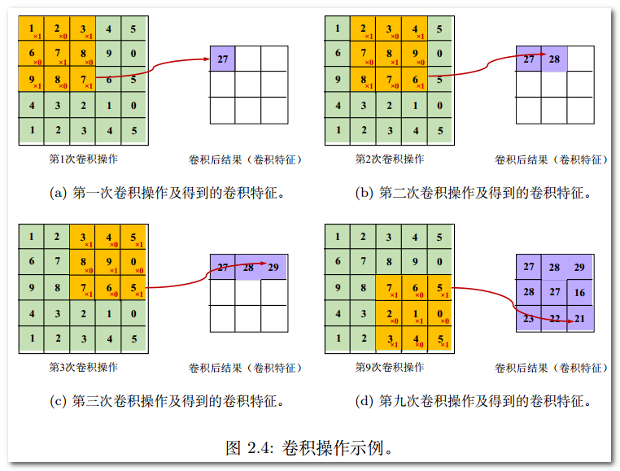

## 
卷积神经网络

#### 0.1 引言

##### 前世今生

1. 二十世纪四十至六十年代当时广为人知的控制论。
    1. 无法处理“**异或**”问题
    2. 无法满足大型神经网络长时间的运行需求。
2. 80年代提出误差反向传播算法(BPA)。
    1. 数据获取瓶颈
    2. 过拟合(overfitting)问题
3. 2006年提出深度置信网络(deep belief network)。

### 第一章 CNN基础知识

#### 1.1 发展历程

1.1998年基于梯度学习的**LeNet**网络应用于邮政手写数字识别系统。
2. 2012年**Alex-Net**在ImageNet竞赛夺冠。

    

#### 1.2 基本结构
首先，CNN为一种层次模型(hierarchical model)，理论上在每一个隐层中存在：

1. 输入层
2. 卷积操作(convolution)
3. 汇合操作/池化操作(pooling)
4. 非线性激活函数(non-linear activation function)
5. 全连接层

    

**回归问题**主要使用L2损失函数：

    

**分类问题**主要使用交叉损失函数：

    

    

**批处理随机梯度下降法：**

- 在每一个批处理过程中都会进行参数更新(误差反向传播)。
- 不同批处理之间按照无放回抽样遍历所有训练集样本，遍历一次训练样本称为“一轮”（epoch）。
- 进行多轮迭代后直到网络参数收敛。

**反向传播算法：**

    

### 第二章 CNN基本部件

#### 2.1 端到端思想

- 整个学习流程并不进行人为的子问题划分，而是完全交给深度学习模型直接学习从原始输入到期望输出的映射。整个过程具有协同增效的优势，有更大可能获得全局最优解
- 将原始数据映射为特征（即特征学习）随后再映射为样本标记（即目标任务，如分类）。

    

**参考文献：**

- [卷积层与池化层][1]{:target="_blank"}.

 [1]: http://www.cnblogs.com/zf-blog/p/6075286.html "http://www.cnblogs.com/zf-blog/p/6075286.html"

#### 2.2 卷积层（convolution）
卷积运算属于分析数学中的一种运算方式，采用mini-batch训练策略时，网络第L层输入通常是一个四维张量，即：***

**两个重要参数：**

- 通道数 
- 每一批训练样本数

    

**重要超参数：**

- 卷积核（亦称卷积参数，convolution kernel或convolution filter）
- 卷积步长（stride）

卷积核按照步长大小在输入图像上**从左至右自上而下**依次将卷积操作**（逐位相乘后累加+偏置项作为一次卷积操作结果）**进行下去，并将结果将作为下一层操作的输入。

形式化的卷积操作可表示为：

    

    

卷积核亦称滤波器：

- 整体边缘滤波器：可消除四周像素值差异小的图像区域而保留显著差异区域，以此检测物体边缘信息。
- 横向边缘滤波器：同理，检测物体横向信息。
- 纵向边缘滤波器：同理，检测物体纵向信息。

**卷积结果**通常称为“**特征图**”或“**通道**”

#### 2.3 汇合层（pooling）

**主要汇合类型：**

- 均值汇合（average-pooling）
- 随机汇合（stochastic-pooling）：元素值大的响应（activation）被选中的概率大，反之亦然。
- 最大值汇合（max-pooling）

**注：**汇合实际为**“降采样”**操作，在全局意义上，随机汇合与平均值汇合近似；在局部意义上，则服从最大
值汇合的准则。

**主要超参数：**

- 汇合操作核大小
- 汇合操作步长

**汇合层特征：**

- 特征不变性
- 特征降维
- 一定程度防止过拟合

#### 2.4 激活函数

激活函数（activation function）层又称非线性映射（non-linearity mapping）层。

**Sigmoid型函数**也称Logistic函数：

    

    

**注：**

- 该函数具有梯度的“**饱和效应**”（saturation effect），当网络当初始化参数过大时，将直接引发梯度饱和效应而无法训练。
- 为了避免梯度饱和效应的发生，Nair和Hinton于2010年将**修正线性单元**（Rectified Linear Unit，简称**ReLU**）引入神经网络。并且，ReLU函数有助于随机梯度下降方法收敛。

**ReLU函数**实际上是一个分段函数，其定义为：

    

    

#### 2.5 全连接层

- **全连接层**（fully connected layer）在整个卷积神经网络中起到“**分类器**”的作
用。
- 如果说**卷积层、汇合层和激活函数层等操作**是将原始数据映射到**隐层特征空间**的话，**全连接层**则起到将学到的特征表示映射到样本的**标记空间**的作用。

### 第三章 CNN经典结构

#### 3.1 重要概念

- **感受野**

1. 感受野即为黄色区域（卷积核所对应区域）。
2. 随着网络深度的加深，后层神经元在第一层输入层的感受野会随之增大。
3. 小卷积核通过多层叠加可取得与大卷积核同等规模的感受野。

    

小卷积核主要优势：

1. 小卷积核需多层叠加，加深了网络深度进而增强了网络容量和复杂度。
2. 增强网络容量的同时减少了参数个数。

- **分布式表示**

深度学习只是**表示学习**（representation learning）的一种方式，在计算机视觉中比较著名的就是“**词包**”模型（bag-of-word model）。
人们通常将图像局部特征作为一个**视觉单词**（visual word），将所有图像的局部特征作为**词典**（vocabulary）。表示向量的每个维度可以对应一个明确的**视觉模式**（pattern）或**概念**（concept）。

    

神经网络中的“分布式表示”指“**语义概念**”（concept）到**神经元**（neuron）是一个**多对多**映射，直观来讲，即每个语义
概念由许多分布在不同神经元中被激活的模式（pattern）表示；而每个神经元
又可以参与到许多不同语义概念的表示中去。

随机选取相同的k张特征图（通道），并将特征图与对应原图叠加，即可得到有高亮部分的可视化结果。

    

卷积神经网络（convolution neural network，CNN）除**分布式表示特性**外，神经网络响应的区域多呈现“**稀疏**”（sparse）特性，即响应区域集中且占原图比例较小。

- **深度特征的层次性**

随着若干卷积、汇合等操作的堆叠，各层得到的深度特征逐渐从**泛化特征**（如边缘、纹理等）过度到**高层语义表示**（躯干、头部等模式）。

利用**反卷积技术**可对神经网络特征进行**可视化**。

    

对单个网络模型而言“多层特征融合”（multi-layer ensemble）往往是一种很直接且有效的网络集成技术，对于提高网络精度通常有较好表现，

#### 3.2 经典网络案例分析

- **Alex-Net网络模型**

    

**主要训练技巧：**

ReLU激活函数、局部响应规范化（LRN）操作、为防止过拟合而采取的数据增广
（data augmentation）和随机失活（dropout）等。

- **VGG-Nets网络模型**

    

1. VGG-Nets中普遍使用小卷积核以及“保持输入大小”等技巧。
2. VGG-Nets具备良好的泛化性能。

- **Network-In-Network网络模型**

    

1. 采用多层感知机，增加了网络卷积层的非线性能力。
2. 摒弃了全连接层作为分类层的传统，转而改用全局汇合操作（global average pooling）。
3. NIN最后一层共C张特征图（feature map）对应分类任务的C个类别。

    

- **残差网络模型（Residual Network）**

误差信号的多层反向传播非常容易引发梯度“弥散”（梯度过小会使回传的训练误差极其微弱）或者“爆炸”（梯度过大会导致模型训练出现“NaN”）现象。

反常现象：在常规神经网络中，随着继续增加网络的深度，训练数据的训练误差没有降低反而升高。

    

>**高速公路网络**

忽略常规神经网络中层数和偏置，存在如下关系：

    

其中，F为非线性激活函数。对于高速公路网络而言，y的计算定义如下：

    

其中，T()和C()函数分别称为“**变换们**”和“**携带们**”，分别对应两项权重。

在高速公路网络中，设置 **C = 1 - T** ，即有：

    

    

>**深度残差网络**

在高速公路网络中携带们和变换们都为**恒等映射**（恒等映射是指集合A到A自身的映射）时：

    

**残差学习**包含两个分支：

1. 左侧的残差函数。
2. 右侧对于输入的恒等映射。

    

这两个分支经过一个简单整合（对应元素的相加）后，再经过一个非线性的变换**ReLU激活函数**，从而形成整个**残差学习模块**。由**多个残差模块**堆叠而成的网络结构称作“**残差网络**”。

    

**参考文献：**

- [CNN网络架构演进][1]{:target="_blank"}.

 [1]: https://www.cnblogs.com/skyfsm/p/8451834.html "https://www.cnblogs.com/skyfsm/p/8451834.html"

- **深度特征的层次性**

#### 3.2 经典网络案例分析

$$ \times $$
$$
\begin{aligned}
\dot{x} & = \sigma(y-x) \\
\dot{y} & = \rho x - y - xz \\
\dot{z} & = -\beta z + xy
\end{aligned}
$$

### 第2章 CNN基本部件